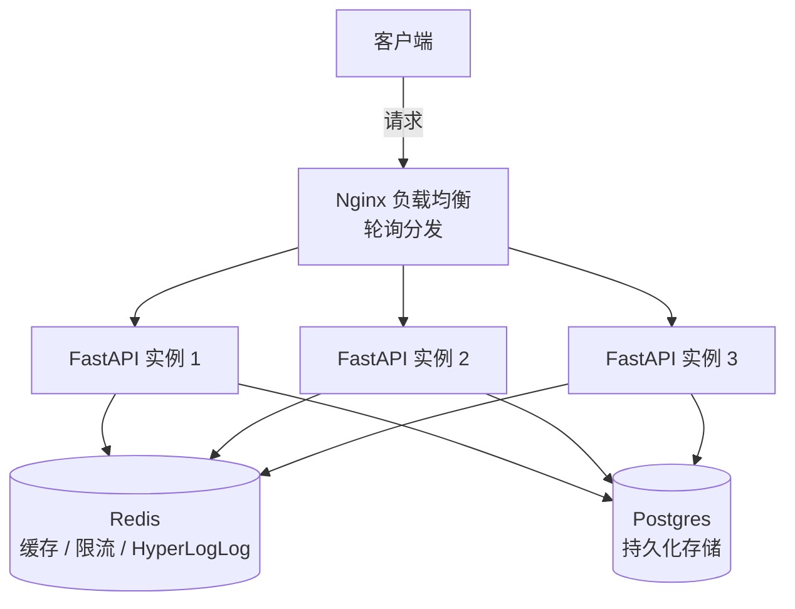
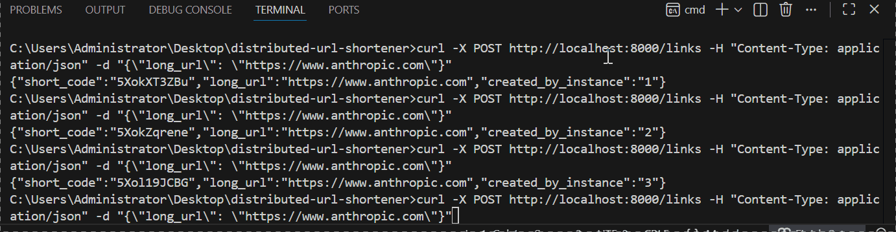

# Distributed URL Shortener

[](https://github.com/Oneletterobsidian/distributed-url-shortener/actions/workflows/ci.yml)

分布式短链接服务 —— 系统设计面试经典题的实物实现，覆盖缓存、限流、一致性哈希、去重统计、压测这一整条分布式系统设计的核心链路，并配有真实压测数据验证每一项设计的实际效果。

---

## 架构



三个独立的 FastAPI 容器模拟"多台机器"，通过 Nginx 做负载均衡，共享同一个 Redis 和 Postgres，验证了分布式系统"多实例共享状态"这一核心设计。

---

## 核心特性

| 模块 | 实现方式 | 解决的问题 |
|---|---|---|
| 短码生成 | 雪花算法 + Base62 编码 | 多实例并发生成短码，无需协调，保证全局唯一 |
| 缓存层 | Redis，Cache-Aside 模式 | 减少数据库读压力，即使数据库故障也能继续提供已缓存链接的访问 |
| 限流 | 令牌桶算法，Redis Lua 脚本保证原子性 | 允许合理突发流量的同时防止系统被打垮 |
| 一致性哈希 | 虚拟节点 + 环形哈希 | 节点扩容时只需迁移一小部分数据，而非全部重新分布 |
| 点击统计 | Redis HyperLogLog | 用固定 12KB 内存估算海量独立访客数，替代传统 Set 方案的线性内存增长 |

---

## 演示

**创建短链接 → 跳转 → 查看统计** 的完整流程：



```bash
# 创建短链接
curl -X POST http://localhost:8000/links \
  -H "Content-Type: application/json" \
  -d '{"long_url": "https://www.anthropic.com"}'
# → {"short_code":"5P27zdgzAc", "long_url":"https://www.anthropic.com", ...}

# 访问短链接，自动跳转
curl -L http://localhost:8000/5P27zdgzAc

# 查询独立访客数（HyperLogLog 估算）
curl http://localhost:8000/links/5P27zdgzAc/stats
# → {"short_code":"5P27zdgzAc", "unique_visitors": 1}
```

---

## 压测结果（Locust）

在纯读路径（缓存命中场景为主）下，逐步加压得到的真实数据：

| 并发用户数 | RPS | 中位数延迟 | 95分位延迟 | 99分位延迟 | 失败率 |
|---|---|---|---|---|---|
| 50 | 856 | 3ms | 4ms | 7ms | 0% |
| 200 | ~1,600 | 53ms | 78ms | 100ms | 0% |

在两个并发梯度下，**失败率始终保持 0%**；200并发下系统依然稳定运行，延迟上升符合预期（接近当前测试环境的自然承载边界，而非代码缺陷——三个应用容器与Redis/Postgres的CPU占用全程都远未打满）。

写路径（创建短链接）受限流保护，主动将单IP的创建速率限制在低水平，验证了"读多写少"系统设计理念在真实数据中的体现。

---

## 一致性哈希：实测验证

用普通哈希取模和一致性哈希两种方案，对比"节点从3台扩容到4台"时需要重新分布的数据比例：

| 分片方案 | 需要重新分布的数据比例 |
|---|---|
| 普通哈希取模 | 75.43% |
| 一致性哈希（含虚拟节点） | 26.79% |

实测结果与理论值（约 25%）高度吻合，验证了一致性哈希把节点扩容的迁移成本从"几乎全部重新洗牌"降低到"只影响约四分之一"这一核心设计目标。

---

## 技术栈

- **应用框架**：FastAPI（异步）、Uvicorn
- **数据库**：PostgreSQL + SQLAlchemy（async）
- **缓存/中间件**：Redis（缓存、限流、HyperLogLog）
- **部署**：Docker、Docker Compose、Nginx
- **测试**：pytest、fakeredis、内存 SQLite、GitHub Actions CI
- **压测**：Locust

---

## 本地运行

```bash
git clone https://github.com/Oneletterobsidian/distributed-url-shortener.git
cd distributed-url-shortener
docker-compose up -d --build
curl http://localhost:8000/health
```

## 运行测试

```bash
docker exec -it distributed-url-shortener-api1-1 python -m pytest -v
```